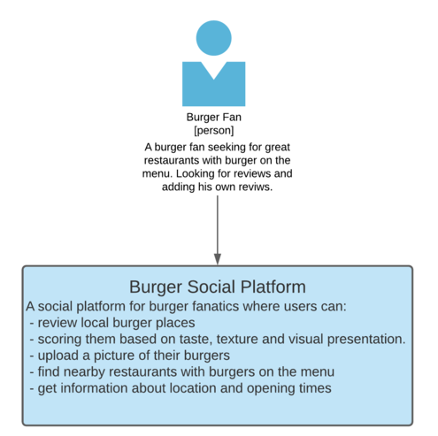

# BurgerBackend
Burger Backend 1.0

ASP.NET Core Web API for a new social platform for burger fanatics where users can review local burger places, scoring them based on taste, texture and visual presentation.
The users are also able to upload a picture of their burgers, in order to entice fellow burger fanatics.
On the platform, the user is also able to find nearby restaurants with burgers on the menu, read information about location and opening times. The new Burger
Backend 1.0™ (trademark pending) is designed to be consumed on multiple platforms, both mobile and web.

## Context

## Containers

## Components

## Code

### Implementation Details

ASP.Net Core (5.0) Web Application, implemented in C#, using Visual Studio 2019. For database connection and data management it uses Entity Framework Core and supports SQL or InMemory Postgres database. \
The API exposes a Swagger UI for documentation and testing purposes.

The Solution contains 2 projects
 - BurgerBackend: contains the implementaion of the models, controllers, data transfer objects, datacontext, repository, GeoService and ImageService
 - BurgerBackendTest: contains test classes and methods for testing the repository and controllers.

#### BurgerBackend

##### Controllers

***RestaurantsController***
Implements functions for creating new Restaurant, getting restaurant information, updating restaurant information, deleting restaurant, uploading/downloading images of burgers.
Depends on
- `IBurgerRepository` for accessing the database for CRUD operations.
- `IMappers` for mapping DTO objects to Entities and back.
- `IGeoService` for getting location information.
- `IImageService` for uploading/downloading information from a blob storage.

***ReviewsController***
Implements functions for creating a new review for a Restaurant or getting reviews for a Restaurant.
Depends on
- `IBurgerRepository` for accessing the database for CRUD operations.
- `IMappers` for mapping DTO objects to Entities and back.
- 
##### Data
The `BurgerDBContext` represents the database schema and used in Entity Framework to create database schema.\
The `IBurgerRepository` maps CRUD operations to functions required by the controllers.
The connectionString must be configured in the `appSettings.json` file.

##### DTO
Data Transfer Objects carry data between the different layers.

##### Models
Contains the models classes used to create database schema.

##### Services
Special services provide extra functionality beside the database management.

`IGeoService` defines the contract to get Geo Location, GeoCode and address to GPS coordinates, get GeoDistance between coordinates
The current implementation (`GoogleGeoService`) uses Google Public APIs. The API key must be configured in the `Startup.cs`.

`IIMageService` defines the contract to upload/download images and get a list of image names in the requested folder in the blob storage.
Two implementations provided:
- `ImageService` uses local file system
- `AWSsrImageService` uses AWS S3 buckets and AWS SDK for accessing the S3 buckets. The awsAcceseKeyId and awsSecretAccessKey must be configured in the `Startup.cs`.

#### BurgerBackendTests

The tests project contains several test for the `RestaurantsController` and `ReviewsController` functions and also for the `BurgetRepository`. It uses prepopulated in-memory Postgres database for test data.

